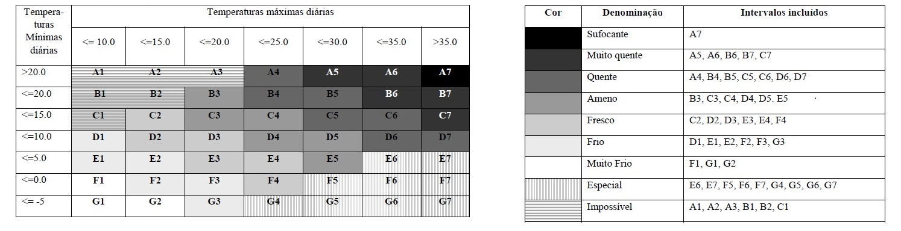

# Análise de temperaturas máximas e mínimas
Aplicado à cidade de São Paulo no período de 1961 a 2015.

O código aqui presente fez parte do projeto de Cultura e Extensão realizado na Universidade de São Paulo junto à professora Rita Ynoue (do Instituto de Astronomia, Geofísica e Ciências Atmosféricas - IAG USP) entre os anos de 2016 e 2017.

O objetivo do projeto era descobrir se os dias frios em Sâo Paulo estavam diminuindo em quantidade.
Isto foi feito utilizando a metodologia criada por Estévez et al. (2012), baseada nas duas Tabelas abaixo:

As tabelas de entrada para o código possuem as seguintes configurações:

<<<< >>>>>
<<<< >>>>>

Com elas, é possível fazer a análise das temperaturas através da criação de uma matriz.
O exemplo abaixo se refere à matriz dos dados do observatório do IAG entre 1961 e 2015 (em formato .csv):

Com um breve tratamento no arquivo, temos o exemplo abaixo para apresentação da tabela de saída.
O código permite fazer diversas alterações nas matrizes de saída. Separação em cada ano, a cada 5 anos, 10 anos e 30. E com a possibilidade de adicionar as quatro estações (verão, outono, inverno, primavera) a cada período de tempo.
Neste caso específico, apresento os valores para os verões entre 1961 e 1965 e para os verões entre 2011 e 2015 (é perceptível o aumento de dias quentes entre os dois períodos):

Estévez, David Martín, Luis Bartolomé Lecha Estela, Jorge Olcina Cantos, Pablo Fernández de
Arróyabe (2012) CLASIFICACIÓN COMPLEJA Y OBJETIVA DE LOS ESTADOS DEL TIEMPO DIARIOS
SEGÚN LA ESTRUCTURA DEL RÉGIMEN TÉRMICO DEL AIRE Y OTROS INDICADORES
BIOMETEOROLÓGICOS. Conference: VIII Congreso de la Asociación Española de Climatología, At
Salamanca, España.
